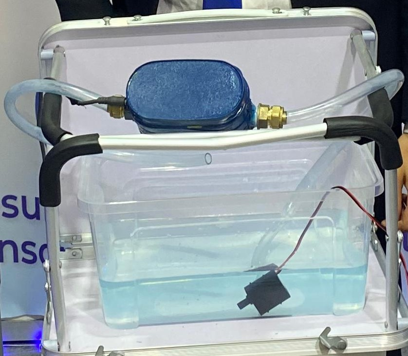

# SABIB-Electronic-Circuits

- Here below it's a display of the SABIB project (just a prototype though 😅), we presented at the FEECRA exposition 💪

I will document my journey realizing the electronic circuit for the SABIB project here.

---

## Content:

- You can expect to find the necessayr libraries in **fzpz** that I used in my circuit. To be found in [Libraries-Fritzing](./Libraries-Fritzing/)
- Code implementation of each circuit to test
- Final Circuit where I merged all the test circuits into one big one 🐬

---

## Circuit Realized:

- I realized the circuit of Electric-Valve with ESP32, refer to [Electric-Valve-Command](./Electric-Valve-Command/)
- I realized the circuit of Electric Valve with Push Button, refer to [Electric-Valve-Push-Button](./Electric-Valve-Push-Button/)

- Final version of SABIB, that we realized and presented in FEECRA exposition, refer to [Final-Version-SABIB-V0.0](./Final-Version-Valve-Push-Flow/), in my humble opinion it still needs some improvements to it, but yeah it's a start 🤭

---

## Author

- [`@Josh-techie`](https://github.com/Josh-techie) | Software Engineer Student

  > Reach out to me if you need any help or have any questions.

  
   | 
    
     | 
    